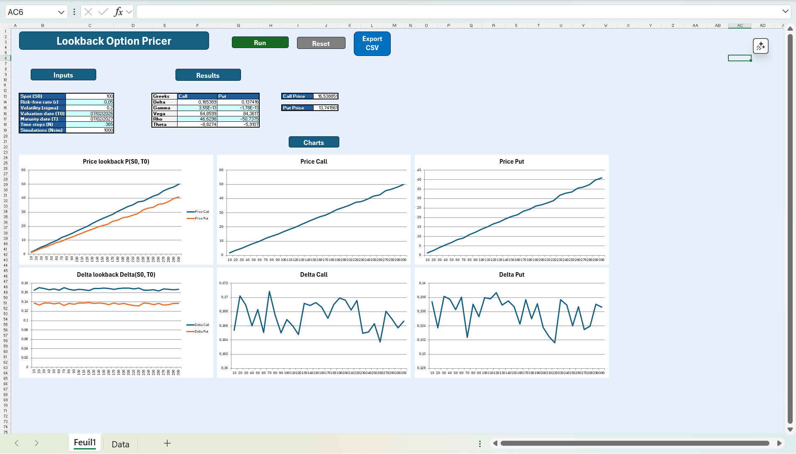
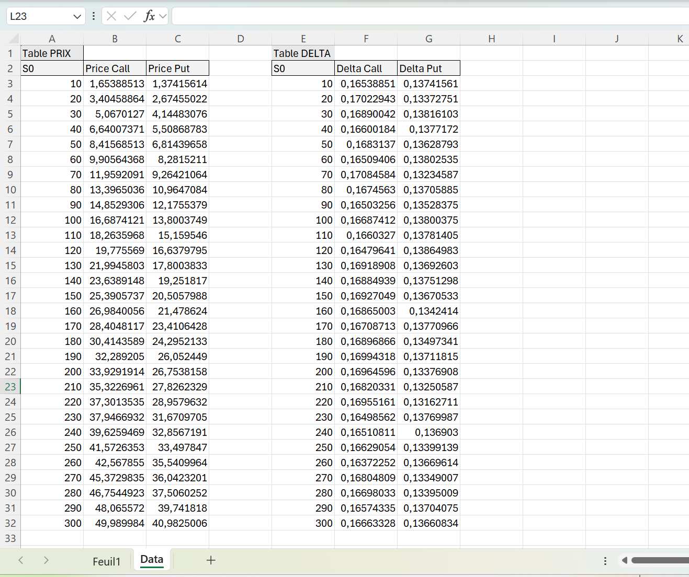

# Lookback Options Pricer (Monte Carlo + Excel/VBA)

## Overview

This project implements a European **floating-strike lookback option** pricer under the **Black–Scholes** model using **Monte Carlo** simulation in **C++**, with an **Excel/VBA** interface for inputs and visualization.

The implementation outputs:
- option price
- Greeks: Delta, Gamma, Vega, Rho, Theta
- charts: Price(S0) and Delta(S0)

## Key Features

- Black–Scholes dynamics with Monte Carlo simulation (C++)
- Control variate technique to reduce variance (vanilla option benchmark)
- OpenMP parallelization (`-fopenmp`)
- Price uncertainty output (standard error + confidence interval on price)
- Two entry points:
  - CLI executable producing CSV outputs
  - Windows DLL exporting VBA-friendly functions for Excel
- Excel dashboard:
  - Run / Reset / Export CSV buttons
  - Price(S0) and Delta(S0) charts

Excel macros / buttons:
- Run → `RunDashboard`
- Reset → `ResetDashboard`
- Export CSV → `Lookback_pricer.xlsm!ExportCSV`

## Repository Structure

- `include/`
  - core headers: Black-Scholes model, Monte Carlo engine, option/payoffs, Greeks, DLL exports
- `src/`
  - implementation files (`BlackScholesModel.cpp`, `MonteCarlo.cpp`, `Greeks.cpp`, `VBAExports.cpp`, `main.cpp`)
- `excel/`
  - `Lookback_pricer.xlsm` (Excel/VBA interface)
- `Doxyfile`
  - Doxygen configuration (main page set to `README.md`)
- `Makefile`, `run.sh`
  - optional / legacy scripts (WSL commands below are the recommended path)

## How to Run

Recommended workflow:
- Build either:
  - the C++ executable to generate CSV outputs, or
  - the Windows DLL to run from Excel/VBA
- When using Excel, the DLL (and runtime dependencies if needed) must be placed in a Windows-readable path (e.g. `C:\...`).

The exact build/run steps are listed in the Commands section below.

## Excel interface (screenshots)

### Excel dashboard (UI)



Buttons / macros:
- **Run** → `RunDashboard`
- **Reset** → `ResetDashboard`
- **Export CSV** → `ExportCSV`

### Data sheet (tables used by charts)




## Build & Run Commands

---

### 1) WSL commands

```bash
cd /mnt/c/Projet_Informatique_M2QF
pwd
git status -sb
```

#### 1.1 C++ executable (CSV)

```bash
mkdir -p build/output
rm -f build/lookback.exe

g++ -std=c++17 -O3 -Iinclude -fopenmp \
  src/BlackScholesModel.cpp src/MonteCarlo.cpp src/Greeks.cpp src/main.cpp \
  -o build/lookback.exe
```

CALL (reduced parameters to limit runtime):

```bash
./build/lookback.exe --type CALL --r 0.05 --sigma 0.20 --T 1.0 \
  --steps 252 --paths 50000 --batch 4 --seed 42 \
  --Smin 50 --Smax 150 --dS 10 \
  --out build/output/price_greeks_call.csv

head -n 3 build/output/price_greeks_call.csv
```

#### 1.2 Windows DLL (Excel/VBA)

```bash
rm -f build/lookback.dll

SRCS=$(ls src/*.cpp | grep -v 'main.cpp')

x86_64-w64-mingw32-g++ -std=c++17 -O3 -Iinclude -fopenmp \
  -DLB_BUILD_DLL -shared \
  $SRCS \
  -o build/lookback.dll

file build/lookback.dll
```

#### 1.3 Copy the DLL (and dependencies) into `excel/`

```bash
EXCEL_DIR=/mnt/c/Projet_Informatique_M2QF/excel
cp -f build/lookback.dll "$EXCEL_DIR/lookback.dll"
```

Required dependencies:

```bash
x86_64-w64-mingw32-objdump -p build/lookback.dll | grep "DLL Name"
```

Copy runtime DLLs:

```bash
copy_dll () {
  dll="$1"
  src="$(x86_64-w64-mingw32-g++ -print-file-name="$dll")"
  if [ "$src" != "$dll" ] && [ -f "$src" ]; then
    cp -f "$src" "$EXCEL_DIR/"
    echo "Copied $dll"
  else
    echo "WARNING: cannot locate $dll"
  fi
}

copy_dll libgomp-1.dll
copy_dll libstdc++-6.dll
copy_dll libgcc_s_seh-1.dll
copy_dll libwinpthread-1.dll
```

On Windows:

* open `...\excel\Lookback_pricer.xlsm`
* enable macros
* use “Run / Refresh Charts”.

If Windows blocks files:

```powershell
Unblock-File -Path "C:\Projet_Informatique_M2QF\excel"
```

---

### 2) Cleanup (no exe/dll)

In WSL:

```bash
cd /mnt/c/Projet_Informatique_M2QF

# supprime le build entier (exe, dll, csv)
rm -rf build

# supprime la dll + dépendances copiées dans excel/
rm -f excel/lookback.dll excel/libgomp-1.dll excel/libstdc++-6.dll excel/libgcc_s_seh-1.dll excel/libwinpthread-1.dll

git status -sb
```

---

### 3) Summary

* Numerical computations (Monte-Carlo + control variate + Greeks) are implemented in C++.
* Two entry points:

  * C++ executable → writes CSV outputs
  * Windows DLL → exported functions called by Excel/VBA
* Excel provides the interface and visualization (Price(S0), Delta(S0), Greeks).

```
